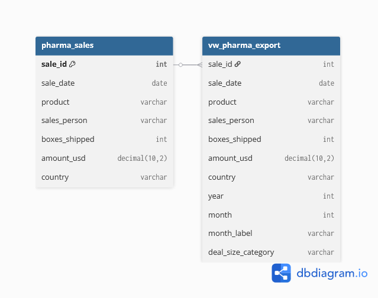
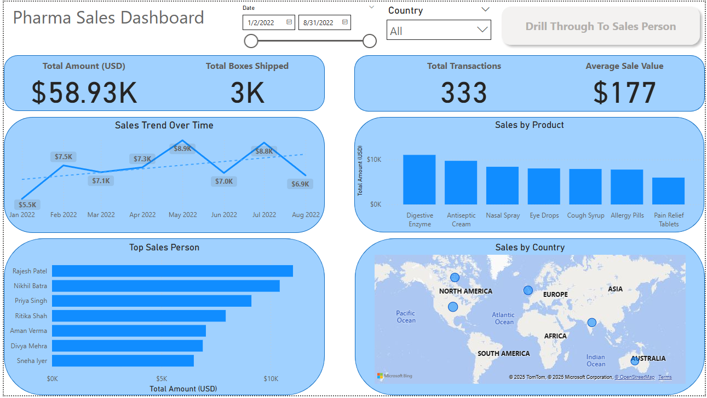
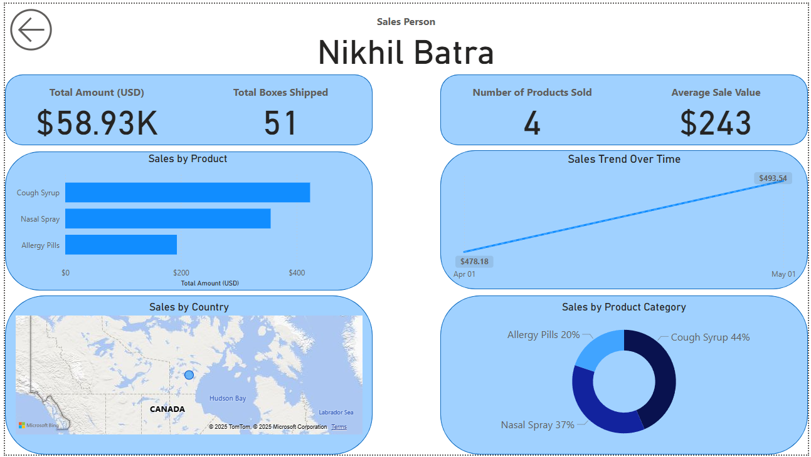

# 💊 Pharma Sales Analytics & Performance Dashboard

---

## 📘 Project Background

This is a personal data analytics project analyzing pharmaceutical sales data to generate actionable insights across **sales management** and **product strategy**.

The dataset simulates a multi-product pharmaceutical sales environment with focus on **performance tracking**, **product mix optimization**, and **geographic distribution**.

Key performance indicators (KPIs) tracked include:

* **Total Amount (USD)**
* **Total Boxes Shipped**
* **Total Transactions**
* **Average Sale Value (ASV)**

Insights and recommendations are provided across four main areas:

1. **Sales Trends Analysis:** Revenue and transaction volume patterns over time  
2. **Product & Category Performance:** Identifying top products and category contributions to revenue  
3. **Salesperson Performance:** Evaluating individual sales rep metrics and top performers  
4. **Geographic & Detail Analysis:** Deep dive into sales patterns filtered by sales reps, countries, and time periods

🔗 **SQL ETL Script:**  
**[View ETL & Analytics Script (etl_customers.sql)](https://github.com/aymaneben595/Pharma-Sales-Analytics-Dashboard/blob/060c60af937bf5d403f8c462343349cb9ed070e8/VSCode%2C%20SQL%20%26%20Python/SQL/etl_customers.sql)**

🐍 **Python ETL/Analysis Script:**  
**[View ETL & Analytics Script (etl_pipeline.py)](https://github.com/aymaneben595/Pharma-Sales-Analytics-Dashboard/blob/060c60af937bf5d403f8c462343349cb9ed070e8/VSCode%2C%20SQL%20%26%20Python/Python/etl_pipeline.py)**

📊 **Dashboard:**  
**[⬇️ Download Pharma Sales Light Mode Dashboard.pbix](https://github.com/aymaneben595/Pharma-Sales-Analytics-Dashboard/raw/060c60af937bf5d403f8c462343349cb9ed070e8/Power%20Bi/Pharma%20Sales%20Light%20Mode%20Dashboard.pbix)**

---

## 🧩 Data Structure & Initial Checks

After a full **ETL process in PostgreSQL**, the dataset contains clean transaction records with key metrics:

* **Total Amount:** $58.93K
* **Total Boxes Shipped:** 3K
* **Total Transactions:** 333

Two main analytical artifacts were produced:

* **`pharma_sales`** → Final structured transaction table (one row per sale)
* **`vw_sales_export`** → Analytical view for BI tools (with calculated fields like `month_label`, `category`, `ASV`)

  

---

## 📈 Executive Summary

### Overview of Findings

The pharmaceutical market generated **$58.93K in total revenue** with an **Average Sale Value (ASV) of $177**. Notable insights include:

* **Top Performer:** **Rajesh Patel** leads all salespersons in total revenue.
* **Product Focus:** Digestive, Antiseptic, and Nasal Spray categories drive revenue by volume.
* **Transaction Volume:** The company completed **333 transactions** across the period.

  

---

## 🔍 Insights Deep Dive

### **Category 1: Sales Trends Analysis**

* **Total Amount:** **$58.93K** from **333 transactions**, confirming precise tracking.
* **Sales Trends Over Time:** Peaks in **August 2022 ($8.8K)**, lowest in **February 2022 ($7.3K)**.
* **Average Sale Value (ASV):** **$177**, indicating stable pricing per transaction.

  

### **Category 2: Product & Category Performance**

* Top revenue-generating products: **Digestive Enzyme, Antiseptic Cream, Nasal Spray**.
* **Priya Singh**'s top products: **Cough Syrup ($1,626)**, **Antiseptic Cream ($1,540)**.
* **Nikhil Batra**'s top products: **Cough Syrup ($493)**, **Nasal Spray ($488)**.
* **Category Volume Share:** **Cough Syrup (28%)**, **Antiseptic Cream (23%)** for Priya Singh.

  

### **Category 3: Salesperson Performance**

* **Rajesh Patel** tops total revenue, followed by **Nikhil Batra** and **Priya Singh**.
* **Nikhil Batra:** 51 boxes shipped, 4 products sold.
* **Priya Singh:** ASV **$169**, 54 products sold, 558 boxes shipped.

  

### **Category 4: Geographic & Detail Analysis**

* **Primary region:** **North America**.
* **Priya Singh:** Sales peak **$1.79K in July 2022**, low **$377.24 in April 2022**.
* **Nikhil Batra in Canada:** ASV **$243**, Total Amount **$58.93K**.
* Filtered trends: April 22 **$478.18 → May 22 $493.54**.

  

---

## 💡 Recommendations

1. **Investigate Seasonal Peak:** Analyze **August 2022 peak ($8.8K)** to replicate success.
2. **Optimize Product Focus:** Prioritize **Digestive Enzyme, Antiseptic Cream, Nasal Spray** in marketing & inventory.
3. **Target High-ASV Segments:** Study Nikhil Batra’s **$243 ASV** for replication.
4. **Sales Performance Coaching:** Use top performers like **Rajesh Patel** to uplift mid-to-low-tier reps.

---

## ⚙️ Assumptions & Caveats

* **Currency:** Figures standardized in **USD**.
* **Time Filters:** Detail views filtered by Sales Person, Country, Date.
* **Geographic Accuracy:** Dependent on correct geo-coding.

  <i>Created by Aïmane Benkhadda — Personal Data Analytics Project (Excel, SQL, Power BI, Python)</i>
   
  <a href="mailto:aymanebenkhadda5959@gmail.com">aymanebenkhadda5959@gmail.com</a>

